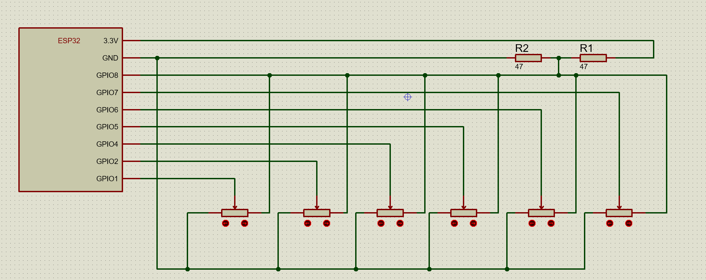
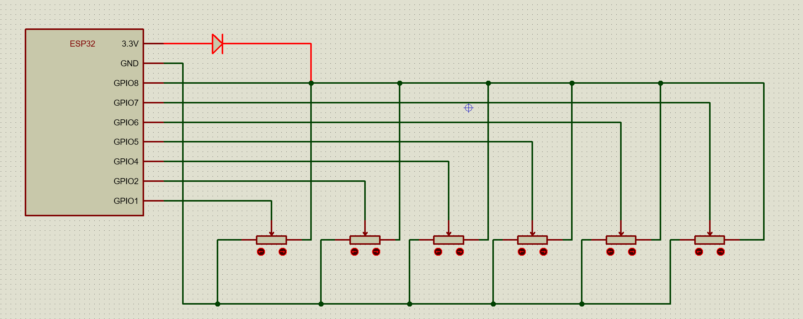

# 🧭 ESPHome Deej Fork

A **variant of [Deej](https://github.com/omriharel/deej)** that uses **[ESPHome](https://esphome.io/) (ESP32)** instead of Arduino, with flexible transport options and mute switch implementation.

---

## 💡 Overview

This fork allows the mixer to communicate over either **wired UART** or **Wi-Fi (SSE)**.

Key improvements:

* **Choice of transport layer**: users can now connect via a USB-UART cable or wirelessly over Wi-Fi.
* Multiple Deej software instances can connect to the same mixer over Wi-Fi simultaneously.
* Easy integration into **Home Assistant** (e.g., dimmer control).
* Mute switches support
* Path-based process matching support (e.q. c:\Program Files (x86)\Steam)
  
---

## ⚙️ Firmware & Configuration

To build and flash the ESP32, you’ll need **ESPHome**.
There are ready-to-use Docker containers and plenty of guides available online — setting it up shouldn’t be a problem.
It's a bit tricky because you'll need to put header (mix_tools.hpp) and source (mix_tools.cpp) files to the config folder, but і think - you can handle it.

If you use HA, everything is extremely simple (through the espome and file editor plugins).

[](https://www.youtube.com/watch?v=4NSVlBNJve0)

The ESP32 device configuration (`mix_*.yaml`) and the corresponding header and source files (`mix_tools.hpp` and `mix_tools.cpp`)
are located in this repository under:


```
esphome/
```

* mix_momentary.yaml - If you wish to use momentary switches to mute the sound. 
* mix_latching.yaml - for latching switches (preferred)
* **If you don't need the mute button functionality**, use mix_latching.yaml and comment out or remove the "binary_sensor" block from yaml.

There are 2 options: 
* hardcode your wifi credentials into firmware.
* (preferred) use empty wifi and improv_serial sections and https://web.esphome.io/ (after connecting to device use "vertical ..." -> "Configure WiFi") to configure wifi connection settings any time you want w/o reflashing. 

Optional things (uncomment to activate):
* factory reset button (erase wifi/other settings) 
* home assitant integration
* OTA updates
* Captive portal ([docs](https://esphome.io/components/captive_portal/))

---

## 🚀 Running Deej

### Requirements

* **config.yaml** must be in the same directory as the deej executable.
* For UART connection: ensure the ESP32 is connected via USB and the correct COM port is configured.
* For SSE connection: ensure the ESP32 is on the same network and the URL is correct.

**Linux-specific requirements:**
* **PulseAudio**: Deej requires PulseAudio to be running for audio session management.
* **System tray dependencies**: For building from source, you'll need:
  * `libgtk-3-dev`
  * `libappindicator3-dev`
  * `libwebkit2gtk-4.0-dev`
* **Text editor**: The tray menu uses `$EDITOR` environment variable if set, otherwise falls back to `xdg-open` (which uses your default text editor).

**Platform differences:**
* **Windows-only features** (not available on Linux):
  * `deej.current` - control the currently active window/app
  * `system` - control system sounds volume
  * Device targeting by full name (e.g., "Speakers (Realtek High Definition Audio)")
* **Linux**: Uses PulseAudio for audio session management. Process names are matched by binary name (e.g., `chrome` instead of `chrome.exe`).

### Features

* **Automatic reconnection**: If the connection is lost (UART or SSE), deej will automatically attempt to reconnect every 2 seconds.
* **Hot-reload configuration**: The `config.yaml` file is automatically watched for changes. When you save the file, deej will reload the configuration and notify you via a system notification.
* **System tray icon**: Deej runs in the system tray (Windows/Linux). Right-click the tray icon to:
  * Edit configuration (opens config.yaml in your default text editor)
  * Re-scan audio sessions (useful if new applications are not detected)
  * View version information
  * Quit deej
* **Logging**: All logs are saved to `logs/deej-latest-run.log` for troubleshooting.
  * **Audio devices list**: At startup, deej logs all available audio input/output devices. Check the log file to see device names that can be used in `config.yaml` for device targeting (Windows only).
* **Path-based process matching**: In addition to matching processes by name (e.g., `chrome.exe`), you can now specify directory paths in `slider_mapping`. All processes launched from the specified directory or its subdirectories will be controlled by that slider. This is useful for grouping applications from the same installation directory (e.g., `C:\Program Files (x86)\Steam` on Windows or `/usr/bin/steam` on Linux). Paths are automatically detected and matched case-insensitively on Windows and case-sensitively on Linux.

### Command-line Options

* `--verbose` or `-v`: Enable verbose logging (useful for debugging connection issues)
* Set environment variable `DEEJ_NO_TRAY_ICON=1` to run without a tray icon (useful for headless setups or scripts)

---

## 🔌 Transport Options

You can select your preferred transport in the configuration. 
If both are configured, the software will attempt UART first. 
If UART connection fails (port doesn't exist) and SSE is configured, it will fallback to Wi-Fi SSE. 
If UART port is busy (already in use), the software will stop and notify you instead of falling back to SSE.

### 1. Wired UART (Serial)

**Brief description:** The simplest way to use Deej — one mixer, one PC.

**Benefits:**
* Stable connection with low latency
* No Wi-Fi required
* Simple setup without additional components

**Requirements:**
* Connect ESP32 to your computer via USB cable
* Configure `SERIAL_Port` and `SERIAL_BaudRate` correctly in `config.yaml` (format: `COMx` on Windows or `/dev/ttyUSBx`, `/dev/ttyACMx` on Linux)

---

### 2. Wi-Fi / Server-Sent Events (SSE)

**Brief description:** When ESP32 requires independent power supply.

**Benefits:**
* ESP32 can be always powered and available (Suitable for Home Assistant integration)
* Multiple Deej instances can connect to the same mixer simultaneously
* No drivers needed for Windows or Linux

**Requirements:**
* Connect ESP32 to the same network as your end devices
* Configure `SSE_URL` in `config.yaml` (format: `http://hostname:port/events` or `http://ip-address:port/events`)
* Ensure ESP32 is connected to a Wi-Fi network

---

### 3. Hybrid Setup

**Brief description:** When options 1 or 2 don't quite fit your needs.

**Benefits:**
* Combines benefits of options 1 and 2
* ESP32 is powered and connected to one computer via UART
* Additional computers can connect over Wi-Fi via SSE

**Requirements:**
* Combination of requirements from options 1 and 2

---

### 4. Multi-Wired

**Brief description:** When you were punished by Wi-Fi as a child, and now you're wary of it.

**Benefits:**
* Wired connection to multiple PCs simultaneously
* Each computer works independently through its own UART channel
* Maximum stability and low latency for all connections

**Requirements:**
* **Additional components:**
  * UART isolators (for galvanic isolation)
  * Isolated DC-DC converters (for power supply)
  * USB-UART converters (one per computer, excluding the PC that ESP32 is directly connected to)
* **ESP32 configuration:**
  * Enable `USE_EXTRA_UART` define in `mix_tools.hpp` (uncomment line 5: `#define USE_EXTRA_UART`)
  * Uncomment `on_boot:` and `uart:` sections in ESP32 YAML configuration
* **Each computer's configuration:**
  * Configure `SERIAL_Port` and `SERIAL_BaudRate` in each computer's `config.yaml`

---

### 5. deej as Data Source (Relay Mode)

**Brief description:** When you don't trust Wi-Fi, but Ethernet cables are your thing.

**Benefits:**
* Combines benefits of options 1 and 2
* Use wired Ethernet, Wi-Fi, or even expose data to WAN — flexibility is key
* One deej instance acts as a relay, proxying ESP32 data to multiple clients
* Perfect for scenarios where ESP32 connects via UART to one PC, but other PCs need access too

**Requirements:**
* Requirements from option 1 **OR** option 2 (ESP32 must connect to the relay host)
* Configure `SSE_RELAY_PORT` in the relay host's `config.yaml` (the deej instance connected to ESP32)
* Configure `SSE_URL` on client computers that want to receive data from the relay host
* Ensure relay host and clients are reachable over your network (same LAN, VLAN, or WAN if properly configured)

**Example setup:**
* ESP32 connected via UART to host PC at IP `192.168.1.3`
* On the host PC, set `SSE_RELAY_PORT: 8080` in `config.yaml`
* On client PCs, set `SSE_URL: http://192.168.1.3:8080/events` (or use hostname if you've finally learned to use DHCP properly)

---

## 🧾 Bill of Materials

| Qty | Item                 | Link                                                                |
| --- | -------------------- | ------------------------------------------------------------------- |
| 6×  | Potentiometer Module | [AliExpress](https://www.aliexpress.com/item/1005006733220962.html) |
| 1×  | ESP32 Board          | [AliExpress](https://www.aliexpress.com/item/1005009640243412.html) |
| 6×  | Switch               | Any kind of latching/momentary switch/button. (optionally)          |

  (desolder the **side pins** on the potentiometers before mounting)

  You can, at your discretion, freely change the number of potentiometers or switches, adjusting the YAML to suit your situation.

---

## 🔧 STL / Assembly

* STL files for **this exact BOM** that fit perfectly can be found in the `ref/` directory:
  * big_bot.stl, big_top.stl - 6x sliders + place for 6x buttons switches (drill required count of holes. designed for MTS-101, but, mostly everythings with 6mm mount will fit)
  * small_bot.stl, small_top.stl - 6x sliders.

For assembly you will also need M3 hot inserts with a external diameter of 4.5mm, M3x8 screws, 20x20x2 mm silicone pads.


---

## 🔌 Hardware Notes

The ESP32 ADC limit is about **3.12 V**, while its LDO outputs **3.3 V**.
To stay within range, lower the potentiometer reference voltage:

### Option 1 — use voltage Divider
**(!) in most cases you will need to change adc_attenuation field from 12db to 6db in device configuration yaml**




### Option 2 — use diode (preferred)

Use a small PN diode to drop ≈ 0.2–0.7 V
*(actually, almost any diode will be fine — even one found in a junk box, as long as it’s not burned out)*.




---

## 💡 Hints

* **GPIO 8** is used as the "ADC maximum" reference input.
* to use mute/unmute (sw0..sw5) just connect any switch/latching/momentary button between GPIO9..GPIO14 and GND and configure binary_sensor section in yaml, and, switches_mapping section in deej config.
* status led (blue) states: constantly ON = wifi not configured; blinking = connecting/not connected; constantly OFF = connected

### Non-recommended GPIO pins (ESP32-S3-N16R8)

| Function | GPIO Numbers (Pins on the board) | Reason for non-use |
|----------|----------------------------------|-------------------|
| Analog Input (with Wi-Fi ON) | GPIO12-GPIO18 | Belong to ADC2, which is occupied when using Wi-Fi. |
| Boot | GPIO3, GPIO45, GPIO46, GPIO48 | Could cause boot issues when tied to GND. |


---

## 🧱 License & Build

License, build process, and Deej binary behavior are the same as in the original project:
👉 [https://github.com/omriharel/deej](https://github.com/omriharel/deej)
